# 桌面端和移動端連接海外互聯網的方式

### 写在前面

想要獲取海外信息,第一步就是訪問海外網站,但是由於衆所周知的原因,中國大陸難以直接訪問相當多的海外網站,這就需要藉助一些技術手段,跨越這個門檻,本文介紹一下筆者使用的一些工具,希望能幫到各位克服這個困難.

### 第一章：軟件安裝

[Github](https://github.com) 是出海必知的網站,所有的軟件都通過這個平臺下載安裝.

[v2ray](https://www.v2ray.com) (需科學上網)是訪問海外網站的網絡代理核心,我們可以安裝已內置 `v2ray`的客戶端軟件

**1. 桌面端軟件**

桌面端 `v2ray`客戶端軟件有很多,這裏最推薦[v2rayN](https://github.com/2dust/v2rayN/tags), `v2rayN`支持 `Windows`, `Linux`, `MacOS` 三大平臺, 同時也支持 `Clash`, `sing_box` 等其他核心,各位可以自行探索.

**2. 移動端軟件**

移動端 `v2ray`客戶端軟件分蘋果和安卓兩大平臺,蘋果端推薦[V2BOX](hhttps://apps.apple.com/us/app/v2box-v2ray-client/id6446814690), 安卓端推薦[v2rayNG](https://github.com/2dust/v2rayNG/tags).
注意安卓端可以通過 [Github](https://github.com) 下載安裝, 也可以通過 `谷歌商店`下載安裝, 但是蘋果端只能通過 `App Store下載`, 並且 `App Store`必須切換至海外地區,比如港區或者美區.

### 第二章：獲取訂閱節點

`v2ray`客戶端軟件既支持設置單個網絡代理節點, 也支持更爲強大的節點訂閱.節點訂閱會獲取多個代理節點,可測速驗證節點的有效性和網速,支持隨時更新節點.

**1. 免費節點訂閱**

[Github](https://github.com)上有不少免費的 `v2ray`節點訂閱, 剛開始可以試用一下,這裏推薦幾個.

- [v2rayfree](https://github.com/free-nodes/v2rayfree)
- [free18](https://github.com/free18/v2ray)
- [shaoyouvip](https://github.com/shaoyouvip/free)

免費節點訂閱可以做爲臨時救急使用,更多的免費訂閱各位可以通過 `Google`搜索關鍵字 `v2ray 訂閱 github`獲取

**2. 穩定付費訂閱**

免費節點訂閱雖然不花錢,但是極不穩定,節點失效,網絡龜速,時有發生.筆者經歷了一段免費使用經歷後,果斷轉到使用付費訂閱服務,終於不用再擔心 `斷網`了,這裏推薦一下自己使用的服務,這個平臺性價比比較高,我已經穩定使用了三年,不用擔心跑路的風險.

[大哥雲](https://www.dageyun.net/#/register?code=pssVo7mC)(需科學上網,通過免費節點連通), 註冊好之後點擊左側購買訂閱, 推薦購買 `年付套餐A 300 GB`, 支持支付寶微信, 這個套餐最划算, 可以輸入9折優惠券：`mcuE8uOq`

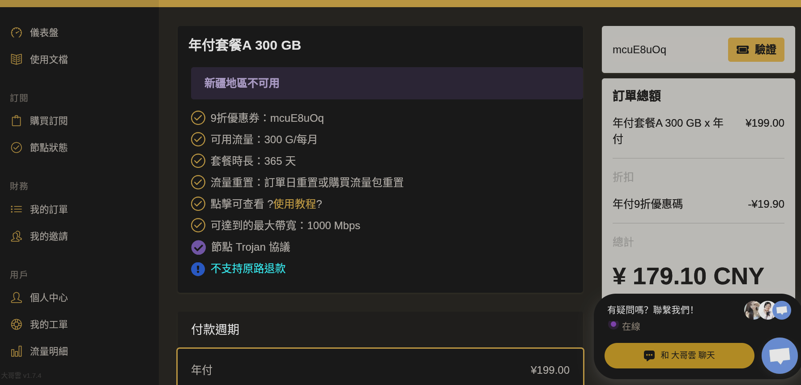

購買成功後, 點擊左側儀表盤,再點擊一鍵訂閱,可以複製訂閱地址.

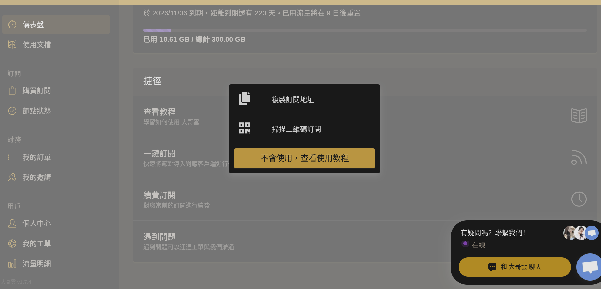

### 第三章：`v2ray`客戶端軟件使用

這裏就以 `Windows` 端 `v2rayN` 爲例演示訂閱地址的使用

**1. 添加節點訂閱**
先通過[Github](https://github.com/2dust/v2rayN/tags)下載安裝好 `v2rayN`

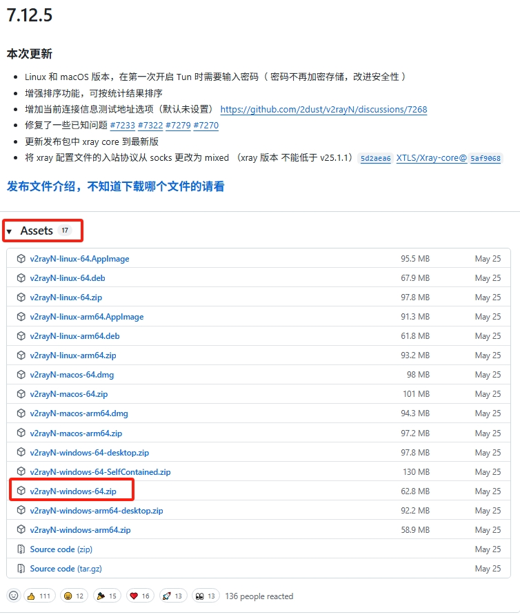

然後打開軟件按照圖示添加和更新節點訂閱

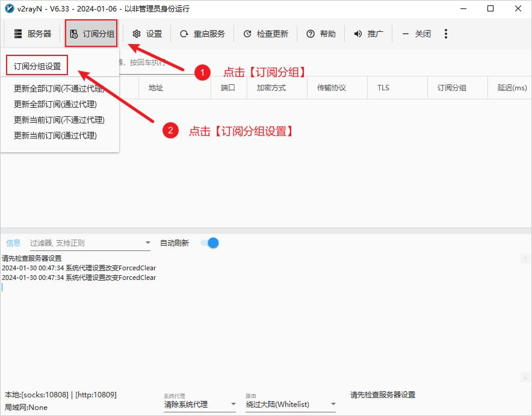

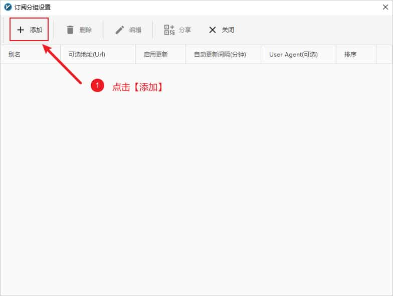

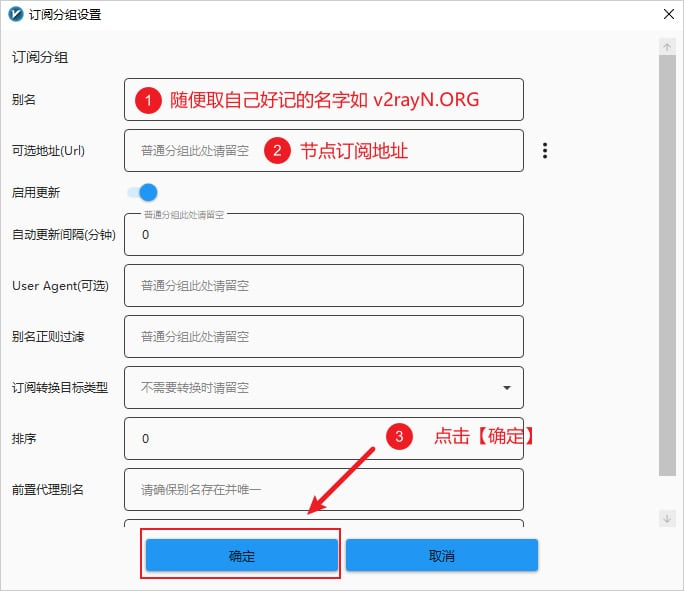

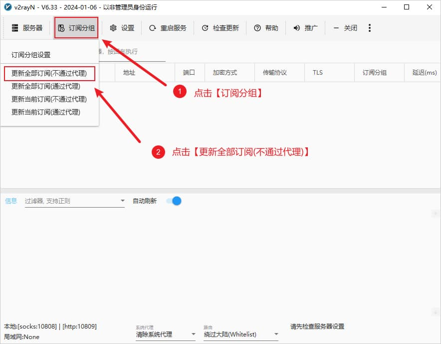

**2. 監聽端口**

設置菜單裏面的參數設置可以更改默認的本地HTTP(S)監聽端口

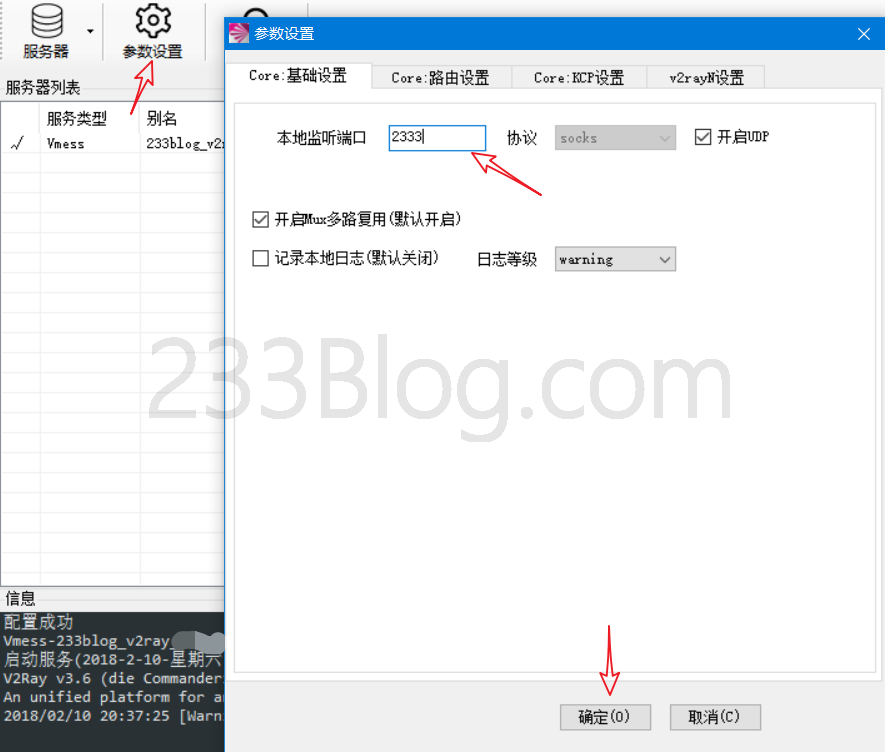

**3. 測試排序節點**

在所有節點列表右鍵一鍵測試節點延遲, 測試完畢後選擇最快的節點.

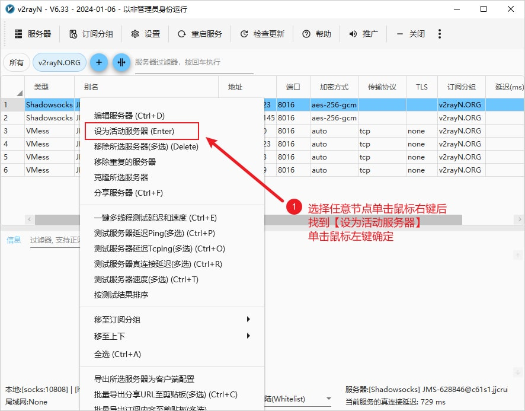

**3. 代理和路由**

設置系統代理, 可以讓整臺電腦網絡環境都能連接外網.在軟件下方配置系統代理,此時軟體的圖標會標稱紅色,至此就可以開始使用了,打開 [Google](https://www.google.com/) 試試能不能訪問吧.

也可以不配置系統代理, 那就需要在瀏覽器中安裝 `Proxy SwitchyOmega` 插件以監聽代理, 具體教程參考 `Proxy SwitchyOmega` 安裝指南.

路由的功能是將入站數據按需求由不同的出站連接發出,以達到按需代理的目的.這一功能的常見用法是分流國內外流量,可以通過內部機製判斷不同地區的流量,然後將它們發送到不同的出站代理,有以下三種路由模式可以選擇.

- 繞過大陸(Whitelist)模式:即原先版本裡的白名單,只是白名單內的網站通過節點伺服器代理上網
- 黑名單(Blacklist)模式:除了黑名單內的網站,其餘網站都通過節點伺服器代理上網
- 全局(Global)模式:所有網站通過節點伺服器代理上網

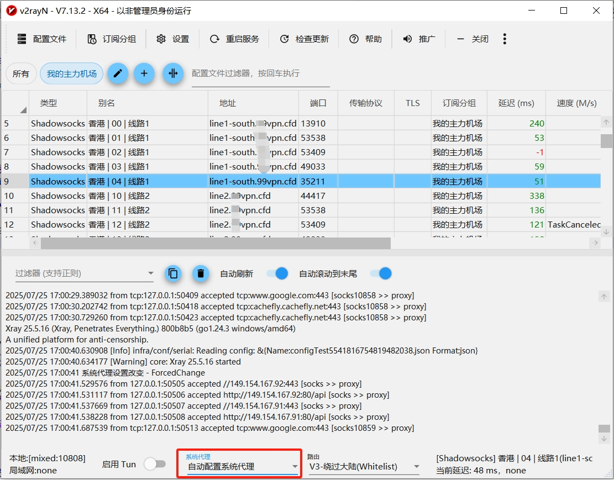

**3. 開機自啟和更新**

點擊設置後進入參數設置, 選擇v2rayN設置勾選上開機自動啟動.

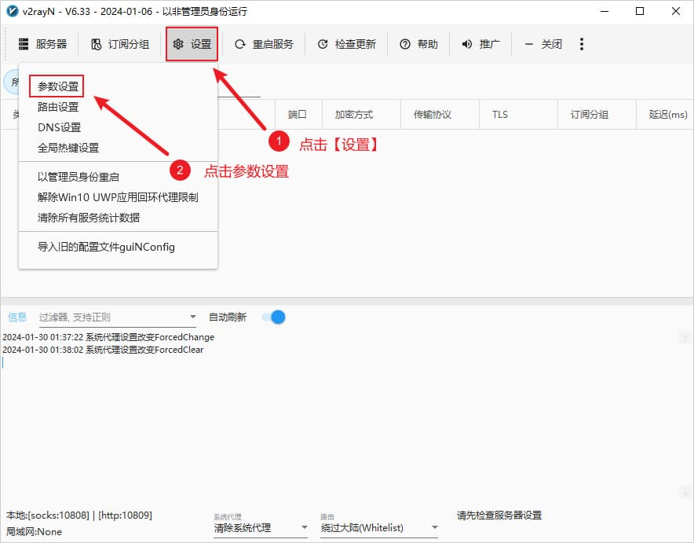

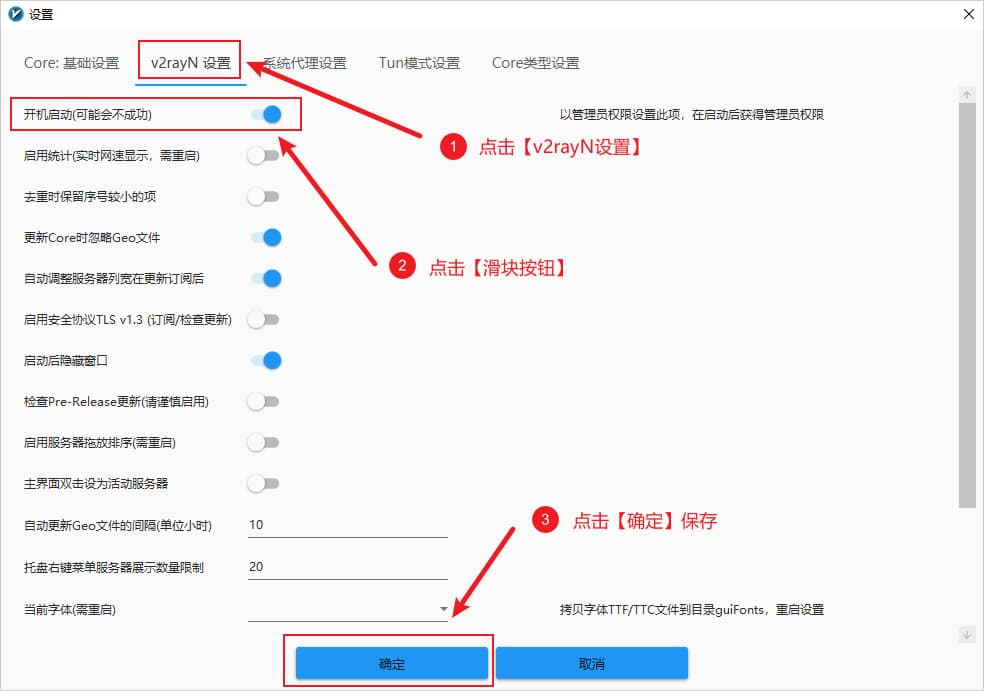

點擊檢查更新菜單自動更新軟件

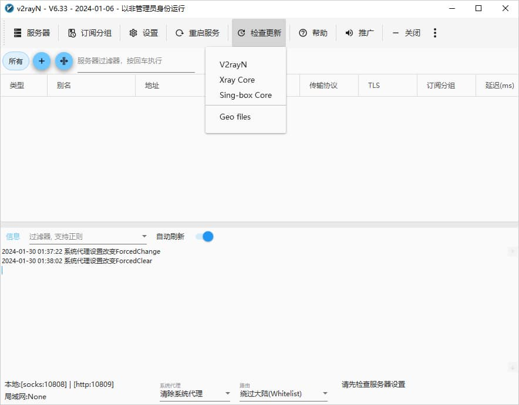

最後就可以暢通訪問 [Google](https://www.google.com/) 了.

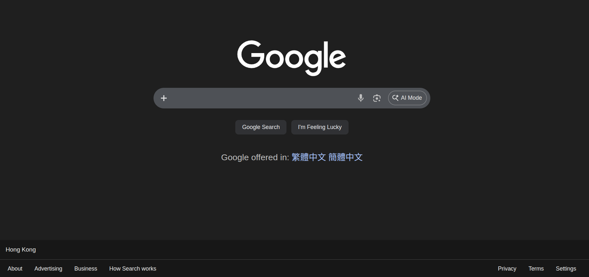
